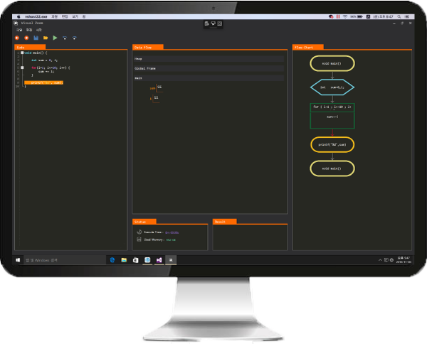

### 소프트웨어 교육을 위한 코드 분석 및 도식화 어플리케이션 개발 

- IITP 주관 2016 소상공인 재능기부 챌린지 사업 참여, 2016.05 ~ 2016.11 

- Overview

  - 프로그래밍 교육 접근성과 이해도를 높이기 위한 코드 분석 및 도식화 프로그램 개발
  - 프로그래밍을 배우는 학생의 접근성과 이해도를 높이기 위해 학생이 작성한 코드를 분석하여 데이터 흐름 및 순서도 도식화 기능 개발
    -  프로젝트에서는 프로그래밍을 처음 배우는 학생의 접근성과 이해도를 높이 기 위해 학생이 작성한 코드를 분석하여 데이터 흐름과 순서도를 도식화 하는 어플리케이션을 개발하였습니다. 저는 변수 선언 및 값 할당과 코드 블록을 통해 데이터 흐름과 순서도를 분석할 수 있는 서버를 개발하였습니다. 또한 분석 결과 를 도식화 어플리케이션에 전달하는 기능을 구현하였습니다. 이 어플리케이션을 통해 학생들은 쉽게 논리적 오류를 확인할 수 있습니다.

- Contribution          

  - 코드 분석 서버 개발           

  - Application UI

    

- Used Skills                       
  \#ANTLR(Compiler-Compiler) 